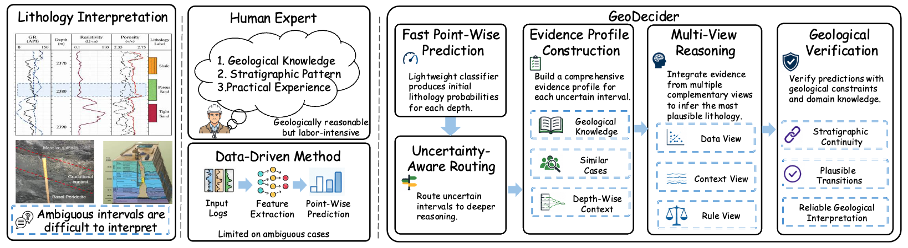
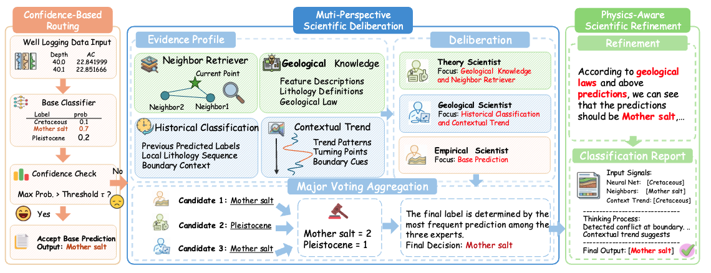

# GeoDecider: An Evidence-Guided Agent for Geological Interpretation


---

GeoDecider is an evidence-guided agent for geological interpretation from well logs. It combines efficient point-wise prediction models with tool-augmented reasoning, allowing confident samples to be classified directly while ambiguous intervals receive deeper geological analysis.

> "GeoDecider: An Evidence-Guided Agent for Geological Interpretation"
> Under review

---

## Overview

Lithology interpretation from well logs is an important task in subsurface characterization, supporting reservoir evaluation and geological modeling. However, automated lithology classification remains challenging because different rock types may exhibit similar logging responses, and reliable interpretation requires combining local observations with geological context, domain knowledge, and physical constraints.

GeoDecider introduces an adaptive coarse-to-fine workflow:

- Uses lightweight classifiers to generate point-wise lithology predictions and confidence scores.
- Routes uncertain intervals to an evidence-guided reasoning workflow.
- Builds an Evidence Profile using geological knowledge, depth-wise trends, historical interpretations, and similar cases.
- Performs multi-view reasoning over data patterns, geological context, and domain knowledge.
- Applies geological constraints to refine predictions and improve sequence consistency.





---

## Key Features

- Adaptive Inference Routing: Directly classifies confident cases and allocates reasoning resources to ambiguous intervals.
- Evidence Profile Construction: Collects complementary geological evidence from specialized tools.
- Tool-Augmented Geological Reasoning: Uses feature descriptions, label knowledge, heuristic classification suggestions, trend analysis, and similar-case retrieval.
- Multi-view Decision Panel: Integrates expert, model-aware, and trend-focused reasoning perspectives.
- Constraint-based Refinement: Enforces depositional environment consistency through geological constraints such as `NM_M`.
- Public Benchmark Evaluation: Experiments on four public well-log benchmarks show consistent improvements over representative baselines.

---

## Getting Started

### 1. Clone the repo

```bash
git clone https://github.com/Xiaoyu-Tao/GeoDecider.git
cd GeoDecider
```

### 2. Environment Setup

```bash
conda create -n geodecider python=3.10
conda activate geodecider
pip install pandas openai
```

### 3. Configure the LLM API

Set your API key and model endpoint in `Facies/api.py` and `Facies/tool_call.py`:

```python
client = OpenAI(
    api_key="YOUR_API_KEY",
    base_url="https://api.deepseek.com",
)
```

### 4. Prepare Input Data

GeoDecider expects well-log data in CSV format. The current workflow uses the following columns:

- `Depth`
- `GR`
- `ILD_log10`
- `DeltaPHI`
- `PHIND`
- `PE`
- `NM_M`
- `RELPOS`
- `Predicted_Facies`

### 5. Run GeoDecider

Set the input and output paths in `Facies/main.py`:

```python
input_file = "path/to/input.csv"
output_file = "path/to/output.jsonl"
```

Then run:

```bash
python Facies/main.py
```

The results are saved as JSONL records containing the prompt, reasoning trace, final answer, selected tools, panel outputs, and refinement metadata.

---

## Workflow

1. Planner: Selects useful geological tools according to the current well-log interval.
2. Evidence Collection: Builds evidence from feature knowledge, lithofacies definitions, classification heuristics, trend analysis, and optional neighbor retrieval.
3. Multi-view Reasoning: Generates decisions from expert, model-aware, and trend-focused perspectives.
4. Panel Aggregation: Aggregates the reasoning outputs into final lithology labels.
5. Geological Refinement: Corrects predictions that violate depositional environment constraints.

---

## Lithofacies Categories

GeoDecider predicts nine lithofacies classes:

- Nonmarine sandstone
- Nonmarine coarse siltstone
- Nonmarine fine siltstone
- Marine siltstone and shale
- Mudstone
- Wackestone
- Dolomite
- Packstone-grainstone
- Phylloid-algal bafflestone

---

## Benchmark Results

Experiments on four public well-log benchmarks demonstrate that GeoDecider consistently outperforms representative baselines, validating the effectiveness of evidence-guided reasoning for reliable geological interpretation.

Full benchmark tables and ablation results will be released with the paper.

---

## Citation

If you find this project useful, please consider citing our paper:

```bibtex
@inproceedings{geodecider2026,
  title={GeoDecider: An Evidence-Guided Agent for Geological Interpretation},
  author={Anonymous},
  booktitle={Under review},
  year={2026}
}
```

---

## Contact

For questions or collaborations, please open an issue or contact the project authors.

---

## License

This project is released for research use. A formal license will be added soon.
